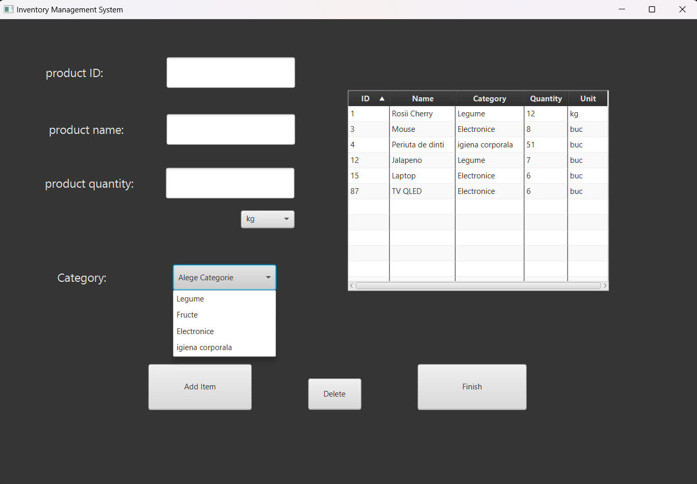

# inventory-management-system
This is the first java project i've been working on.

## Description
The project is to develop an inventory management application for a store that will allow the user to efficiently manage inventory and track product availability in the store. The application will use Java for programming logic and JavaFX to create an intuitive graphical user interface.

## Targets

* Ease of use: Provide a user-friendly interface that allows store staff to perform stock management operations with ease, without the need for advanced technical knowledge.

* Efficiency of stock management: The main goal is to streamline the stock management process and allow quick updating of product information.

* Quick access to information: Facilitate quick search of products by name or category to find and check their availability in real time.

* Accuracy: Ensuring that stock data is always up-to-date and accurate, so as to avoid situations where a product is listed as available but is actually out of stock.

## Interface preview

* the main page where the user can search for products either by id or by name(insesitive case), and get info about a product(id, quantity, date of addition to the inventory).

* the window where the user can add products and create new categories

* the window where the user can edit products:
- increase, or decrease quantity by one unit at the touch of a button;
- change name of the product;
- change the category or unit being prompted with a choice box that lets them select a new category/unit from the existent ones in the database;
- notification when at least one product is running low on supply (the product's quantity drops below 5 units);
- button to show only the low quantity products;
- button to see all products;

